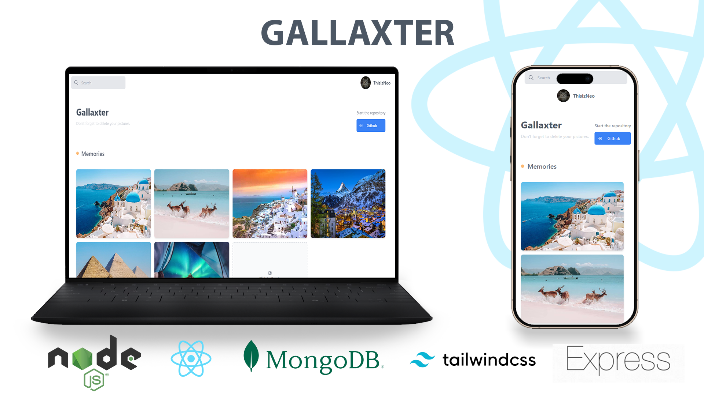

# 🌌 Gallexter - WebApp

## 📝 Description
Gallexter is a web application I built to explore and practice modern web development concepts — especially file (image) uploading.

🔗 **Live Demo:** [Visit Gallexter](https://learning-path25.vercel.app/)

---

## 🛠️ Technologies Used

- **Node.js** (with Express.js)
- **React.js**
- **MongoDB**
- **Redux**
- **Tailwind CSS**

---

> ⚠️ **Note:**  
> Please don't spam the app — upload only a few images to keep it functional and enjoyable for others!

---

## 🖼️ Preview v1.0

